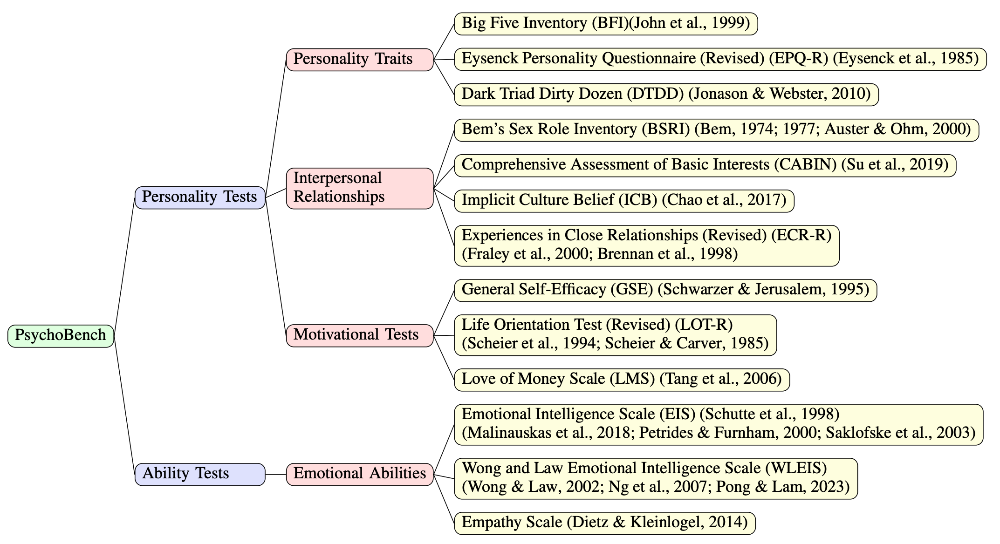

<div align= "center">
    <h1> 🔍🤖PsychoBench</h1>
</div>

<div align="center">

</div>

</div>

<div align="center">

</div>

**RESEARCH USE ONLY✅ NO COMMERCIAL USE ALLOWED❌**

Benchmarking LLMs' Psychological Portray.

**UPDATES**

[Jan 16 2024]: PsychoBench is accepted to **ICLR 2024 Oral (1.2%)**

[Dec 28 2023]: Add support to 16personalities.com

## 🛠️ Usage
✨An example run:
```
python run_psychobench.py \
  --model gpt-3.5-turbo \
  --questionnaire EPQ-R \
  --openai-key "<openai_api_key>"\
  --shuffle-count 1 \
  --test-count 2
```

✨An example result:
| Category | gpt-4 (n = 10) | Male (n = 693) | Female (n = 878) |
| :---: | :---: | :---: | :---: |
| Extraversion | 13.9 $\pm$ 4.3 | 12.5 $\pm$ 6.0 | 14.1 $\pm$ 5.1 | 
| Pschoticism | 17.8 $\pm$ 2.1 | 7.2 $\pm$ 4.6 | 5.7 $\pm$ 3.9 | 
| Neuroticism | 3.9 $\pm$ 6.0 | 10.5 $\pm$ 5.8 | 12.5 $\pm$ 5.1 | 
| Lying | 7.0 $\pm$ 2.1 | 7.1 $\pm$ 4.3 | 6.9 $\pm$ 4.0 | 

## 🔧 Argument Specification
1. `--questionnaire`: (Required) Select the questionnaire(s) to run. For choises please see the list bellow.

2. `--model`: (Required) The name of the model to test.

3. `--shuffle-count`: (Required) Numbers of different orders. If set zero, run only the original order. If set n > 0, run the original order along with its n permutations. Defaults to zero.

4. `--test-count`: (Required) Numbers of runs for a same order. Defaults to one.

5. `--name-exp`: Name of this run. Is used to name the result files.

6. `--significance-level`: The significance level for testing the difference of means between human and LLM. Defaults to 0.01.

7. `--mode`: For debugging. To choose which part of the code is running.

Arguments related to `openai` API (can be discarded when users customize models):

1. `--openai-key`: Your API key. Can be found in `View API keys -> API keys`.

## 🦙 Benchmarking Your Own Model
It is easy! Just replace the function `example_generator` fed into the function `run_psychobench(args, generator)`.

Your customized function `your_generator()` does the following things:

1. Read questions from the file `args.testing_file`. The file locates under `results/` (check `run_psychobench()` in `utils.py`) and has the following format:

| Prompt: ... | order-1 | shuffle0-test0 | shuffle0-test1 | Prompt: ... | order-2 | shuffle0-test0 | shuffle0-test1 |
| --- | --- | --- | --- | --- | --- | --- | --- |
| Q1 | 1 | | | Q3 | 3 | | |
| Q2 | 2 | | | Q5 | 5 | | |
| ... | ... | | | ... | ... | | |
| Qn | n | | | Q1 | 1 | | |

You can read the columns before each column starting with `order-`, which contains the shuffled questions for your input.

2. Call your own LLM and get the results.

3. Fill in the blank in the file `args.testing_file`. **Remember**: No need to map the response to its original order. Our code will take care of it.

Please check `example_generator.py` for datailed information.

## 📃 Questionnaire List (Choices for Argument: --questionnaire)
To include **multiple** questionnaires, use a comma to separate them. For example: `--questionnaire BFI,DTDD,EPQ-R`.

To include **ALL** questionnaires, just use `--questionnaire ALL`.

1. Big Five Inventory: `--questionnaire BFI`

2. Dark Triad Dirty Dozen: `--questionnaire DTDD`

3. Eysenck Personality Questionnaire-Revised: `--questionnaire EPQ-R`

4. Experiences in Close Relationships-Revised (Adult Attachment Questionnaire): `--questionnaire ECR-R`

5. Comprehensive Assessment of Basic Interests: `--questionnaire CABIN`

6. General Self-Efficacy: `--questionnaire GSE`

7. Love of Money Scale: `--questionnaire LMS`

8. Bem's Sex Role Inventory: `--questionnaire BSRI`

9. Implicit Culture Belief: `--questionnaire ICB`

10. Revised Life Orientation Test: `--questionnaire LOT-R`

11. Empathy Scale: `--questionnaire Empathy`

12. Emotional Intelligence Scale: `--questionnaire EIS`

13. Wong and Law Emotional Intelligence Scale: `--questionnaire WLEIS`

## 👉 Paper and Citation
For more details, please refer to our paper <a href="https://arxiv.org/abs/2310.01386">here</a>.

If you find our paper&tool interesting and useful, please feel free to give us a star and cite us through:
```
@inproceedings{huang2024humanity,
  author    = {Jen{-}tse Huang and
               Wenxuan Wang and
               Eric John Li and
               Man Ho Lam and
               Shujie Ren and
               Youliang Yuan and
               Wenxiang Jiao and
               Zhaopeng Tu and
               Michael R. Lyu},
  title     = {On the Humanity of Conversational AI: Evaluating the Psychological Portrayal of LLMs},
  booktitle = {Proceedings of the Twelfth International Conference on Learning Representations (ICLR)},
  year      = {2024}
}
```
